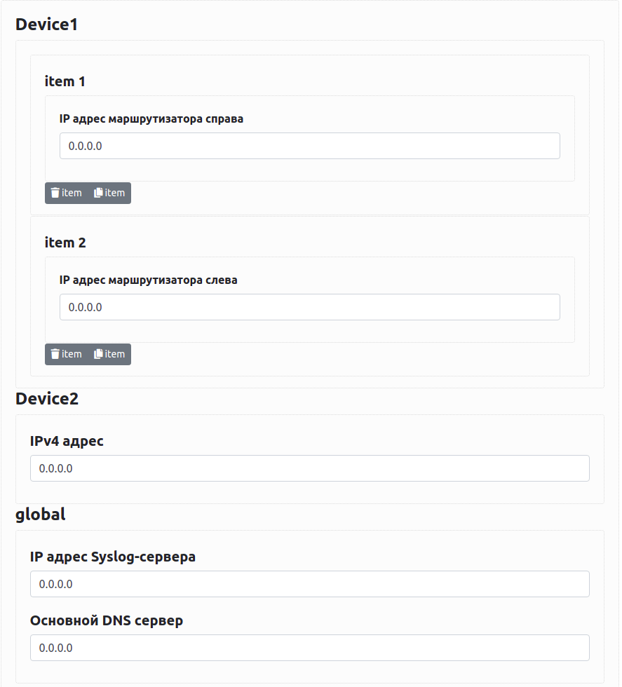

# Baseline Data Form

Baseline Data Form is a django web application that allows you to collect baseline data from your customers.

**Table of Contents:**
- [Installation](#installation)
- [Usage](#usage)
  * [Add new organization](#add-new-organization)
  * [Work with the main form](#work-with-the-main-form)
  * [Get the filled data](#get-the-filled-data)
- [Development](#development)
  * [Structural components](#structural-components)
  * [Logic](#logic)

# Installation

Clone the repo, then install the requirements:

```bash
pip3 install -r requirements.txt
```

Keep in mind that here we're using PostgreSQL database instead of SQLite, so you need to install and configure it (you can use [this tutorial](https://www.digitalocean.com/community/tutorials/how-to-use-postgresql-with-your-django-application-on-ubuntu-14-04)). Once you've installed PostgreSQL, edit `NAME`, `USER` and `PASSWORD` fields in DATABASES variable in `settings.py`

If you want to revert to SQLite, set the next value for DATABASES variable:

```python
DATABASES = {
    'default': {
        'ENGINE': 'django.db.backends.sqlite3',
        'NAME': BASE_DIR / 'db.sqlite3',
    }
}
```

Once you’ve configured one of the databases, create `media/` folder in the project root directory to store config files that customers will upload: `mkdir media`

Then make migrations and run the server:

```bash
python3 ./manage.py makemigrations
python3 ./manage.py migrate
python3 ./manage.py runserver 0.0.0.0:<port>
```

Now you can connect to your server via HTTP: `http://<server's_IP>:<port>/`

# Usage

## Add new organization

Go to the `http://<server's_IP>:<port>/register/` and create a new web form for your customer's organization. Each organization is stored with its UUID that is used in all URLs that are associated with the organization. That's why a customer won't be able to access web-pages of another one (as long as they don't know the exact UUID of another organization).

To register an organization you need:

- Information (in yaml format) about baseline data that you want to collect from your customer. Here's an example:

```yaml
  Router1:   #Central router
    interfaces:
    - ip_mask: 0.0.0.0/0   #IP address/mask
      gateway: 0.0.0.0
    - ip_mask: 0.0.0.0/0
      gateway: 0.0.0.0
  Router2:   #Branch router
    interfaces:
    - ip_mask: 172.22.10.1/31
       gateway: 172.22.10.0
  global:
     syslog: 0.0.0.0
     ntp: 0.0.0.0
     dns1: 0.0.0.0
```

- Number of configuration files that you want to get from your customer (default is 0). We strongly recommend to provide the customer with a comment, which describes what configuration files you want to get.
- (optional) Set of commands for each device that you want the customer to execute in CLI of the devices and provide you with the output. Use yaml syntax the next way:

```yaml
  Device1:
    - command1
    - command2
  Device2:
    - command1
    - command3
```

**Do not leave unknown fields in yaml-data with empty value** (like in the example bellow), cause the parser won't be able to detect the type of the field (actually it would be defined as null and a customer won't be able to put information here):

```yaml
global:
  syslog: 
  ntp: 
```

Instead use empty strings or string with template:

```yaml
global:
  syslog: ""
  ntp: 0.0.0.0
```

Once you've filled the registration form, click "Отправить" button and then you'll be redirected to the web page at `http://<server's_IP>:<port>/<uuid>/`. Your customer can use this link it to edit the form.

## Work with the main form

The information in yaml format about baseline data that you've provided while registering an organization is transformed into a web-form. To get more information about the transformation process see "Development → Logic" section.

As you can see, visibility of some labels in your yaml-data is changed when they are displayed on the web-page. For example, the next yaml-data:

```yaml
global:
  syslog: 0.0.0.0  #IP адрес Syslog-сервера
  ntp: 0.0.0.0  #IP адрес NTP-сервера
  dns1: 0.0.0.0  #IP адрес основного DNS-сервера
```

will be displayed this way:



In addition, we apply the next substitutions (case sensitive) that are applied after yours (the alternative variants are set in round brackets):

<table>
  <thead>
  <tr>
    <th>Original</th>
    <th>Substitution</th>
  </tr>
  </thead>
  <tbody>
  <tr>
    <td>ip</td>
    <td>IP адрес</td>
  </tr>
  <tr>
     <td>gateway (gw)</td>
     <td>Шлюз</td>
  </tr>
  <tr>
     <td>default gateway (default gw)</td>
     <td>Шлюз по умолчанию</td>
  </tr>
  <tr>
     <td>ip_mask</td>
     <td>IP адрес/маска</td>
  </tr>
  <tr>
     <td>network</td>
     <td>Подсеть</td>
  </tr>
  <tr>
     <td>interfaces</td>
     <td>Интерфейсы</td>
  </tr>
  <tr>
     <td>syslog</td>
     <td>Syslog-сервер</td>
  </tr>
  <tr>
     <td>aaa</td>
     <td>Сервер аутентификации</td>
  </tr>
  <tr>
     <td>ntp</td>
     <td>NTP-сервер</td>
  </tr>
  <tr>
     <td>dns1</td>
     <td>Основной DNS-сервер</td>
  </tr>
  <tr>
     <td>dns2</td>
     <td>Резервный DNS-сервер</td>
  </tr>
  </tbody>
</table>

## Get the filled data

To get the last saved version of the yaml-data in plain text use `http://<server's_IP>:<port>/<uuid>/yamldata.yml`

To get files that the customer uploads see `media/<uuid>/` folder.

The commands output is stored in json format, here's an example:

```json
{
  "FortiGate-100F": {
    "show system interface": "config system interface\n    edit \"dmz\"\n        set vdom \"root\"\n        set allowaccess ping https fgfm fabric\n        set type physical\n        set role dmz\n        set snmp-index 1\n    next\nend"
  },
  "FortiManager-VM64": {
    "diag dvm adom list": "There are currently 0 ADOMs:\n---End ADOM list---"
  }
}
```

 To get this information use `http://<server's_IP>:<port>/<uuid>/commands.json`

# Development

## Structural components

**Models and forms**

The major components of the project is OrganizationModel, which is defined in `models.py` (all main files are stored in `main/` folder). It is used to create and store information about organizations in database.

The DocumentModel is associated with OrganizationModel and is used to store information about the files that the customer uploads. See `models.py` file to get more information.

The OrganizationForm and DocumentForm correspond the models and are used to create web-form from the models' fields. See `forms.py` file to get more information.

**URLs and web output**

All the URLs are defined in urls.py file. Each URL corresponds the web output—the view. A view defines logic of the responses according to HTTP-requests. See views.py file to get more information. Also keep in mind that all the HTML files are stored in `main/tempales/` directory.

## Logic

The conversion of yaml-data to web form is implemented the next way: yaml-data → json → web form. To get more information about the editor, which is used to convert json to web form, see [https://github.com/json-editor/json-editor](https://github.com/json-editor/json-editor).

Also this json-editor is used to generate "commands" page. Once you've provided set of commands (in yaml format) for each device that you want the customer to execute in CLI, it is transformed in web-form with text-areas as it's defined in `modules/commands_to_schema.py` file.

To get more information read the code, it's well documented.
