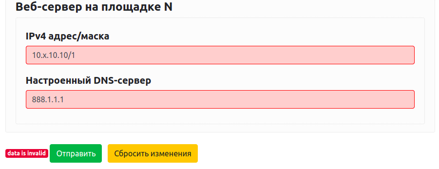

# Baseline Data Form

Baseline Data Form is a Django application that allows you to collect baseline data from your customers.

### Online Demo

Check out our demo: [https://data.solidex.by/a349beb9-b9ed-430f-9e2d-5c2c29c0432d/](https://data.solidex.by/a349beb9-b9ed-430f-9e2d-5c2c29c0432d/)

---

**Table of Contents:**

- [Installation](#installation)
- [Usage](#usage)
  * [Add new organization](#add-new-organization)
  * [Work with the main form](#work-with-the-main-form)
      + [Change visibility of labels' names](#change-visibility-of-labels-names)
      + [Validation of the input](#validation-of-the-input)
      + [Multi-line comments](#multi-line-comments)
  * [Upload and delete files](#upload-and-delete-files)
  * [Access the filled data](#access-the-filled-data)
  * [Feedback](#feedback)
- [Development](#development)
  * [Building blocks](#building-blocks)
  * [Edit substitutions and input validation](#edit-substitutions-and-input-validation)
  * [Logic](#logic)
  * [Unique substitutions and validation](#unique-substitutions-and-validation)

# Installation

Clone the repo, then install the requirements:

```bash
pip3 install -r requirements.txt
```

Here we're using PostgreSQL database instead of SQLite, so you need to install and configure it (you can use [this tutorial](https://www.digitalocean.com/community/tutorials/how-to-use-postgresql-with-your-django-application-on-ubuntu-14-04)). Once you've installed PostgreSQL, edit `NAME`, `USER` and `PASSWORD` fields in DATABASES variable in `settings.py` file.

If you want to revert to SQLite, set the next value for DATABASES variable:

```python
DATABASES = {
    'default': {
        'ENGINE': 'django.db.backends.sqlite3',
        'NAME': BASE_DIR / 'db.sqlite3',
    }
}
```

Once you’ve configured one of the databases, create `media/` folder in the project root directory to store config files that customers will upload: `mkdir media`

Also, don't forget to set `Debug = True` in the `settings.py` file in case you're not ready to use it in production.

Then make migrations and run the server:

```bash
python3 ./manage.py makemigrations main
python3 ./manage.py collectstatic --no-input
python3 ./manage.py migrate
python3 ./manage.py runserver 0.0.0.0:<port>
```

Now you can connect to your server via HTTP: `http://<server's_IP>:<port>/`

# Usage

## Add new organization

Go to the `http://<server's_IP>:<port>/register/` and create a new webform for your customer's organization. Each organization is stored with its UUID. This UUID is used in all URLs that are associated with the organization. That's why a customer won't be able to access the web-pages of another one (as long as they don't know the exact UUID of another organization).

To register an organization you need:

- The information (in YAML format) about baseline data that you want to collect from your customer. Here's an example (pay attention to the comments, we'll talk about them later):

```yaml
Device1:   #[Central router]
  ip_mask: 0.0.0.0/0   #[IP address/mask][ipmask]
  next-hop: 0.0.0.0
Device2:   #[Branch router ##
           # That one which is not central]
  interfaces:
  - ip_mask: 172.22.10.1/31   #[IP address and mask]
    next-hop: 172.22.10.0
  - ip_mask: 0.0.0.0/0
    next-hop: 0.0.0.0
global:
   syslog: 0.0.0.0
   ntp: 0.0.0.0
   dns1: 0.0.0.0
```

- The number of configuration files that you want to get from your customer (default is 0). We strongly recommend providing the customer with a comment, which describes what configuration files you want to get.
- Email addresses of people who want to receive messages every time a customer updates the form.
- (optional) A set of commands for each device that you want the customer to execute in CLI of devices and provide you with the output. Use YAML syntax the next way:

```yaml
Device1:
  - command1
  - command2
Device2:
  - command1
  - command3
```

**Do NOT leave unknown fields in YAML-data with an empty value (or null value)** like in the example below, cause the parser won't be able to detect the type of the field correctly (actually it would be defined as null and a customer won't be able to put information here):

```yaml
!!!INCORRECT
global:
  syslog: 
  ntp: null 
```

Instead, use empty strings or strings as a template:

```yaml
global:
  syslog: ""
  ntp: 0.0.0.0
```

Note: If you want to use a number as the label's name, put it in single or double quotes (the editor doesn't support number as a key).

Once you've filled the registration form, click "Отправить" button and then you'll be redirected to the web page at `http://<server's_IP>:<port>/<uuid>/`. Your customer can use this link it to edit the form.

## Work with the main form

The information about baseline data that you've provided while registering an organization is transformed into a webform. To get more information about the transformation process see [Development → Logic](#logic) section.

### Change visibility of labels' names
The visibility of some labels in your YAML-data may be changed when they are displayed on the web-page. For example, the next YAML-data:

```yaml
Device1:
  - ip: 0.0.0.0 #[IP адрес маршрутизатора справа]
  - ip: 0.0.0.0 #[IP адрес маршрутизатора слева]
Device2:
  ip: 0.0.0.0
global:
  syslog: 0.0.0.0  #[IP адрес Syslog-сервера]
  dns1: 0.0.0.0
```

will be displayed this way:


So if you want to change the label's visibility, provide its name in a comment using square brackets. 

**Do NOT use spaces** to separate `#` and `[` symbols.

In addition, we apply the next substitutions (case sensitive) for the label's names in the first column in case you don't provide any substitution for a particular label. The alternative variants are set in round brackets:

<table>
  <thead>
    <tr>
      <th>Original</th>
      <th>Substitution</th>
    </tr>
  </thead>
  <tbody>
  <tr>
    <td>ip</td>
    <td>IPv4 адрес</td>
  </tr>
  <tr>
    <td>ip6</td>
    <td>IPv6 адрес</td>
  </tr>
  <tr>
     <td>gateway (gw)</td>
     <td>Шлюз</td>
  </tr>
  <tr>
     <td>default gateway (default gw)</td>
     <td>Шлюз по умолчанию</td>
  </tr>
  <tr>
     <td>ip_mask</td>
     <td>IPv4 адрес/маска</td>
  </tr>
  <tr>
     <td>ip6_mask</td>
     <td>IPv6 адрес/маска</td>
  </tr>
  <tr>
     <td>network</td>
     <td>Подсеть</td>
  </tr>
  <tr>
     <td>interfaces</td>
     <td>Интерфейсы</td>
  </tr>
  <tr>
     <td>syslog</td>
     <td>Syslog-сервер</td>
  </tr>
  <tr>
     <td>aaa</td>
     <td>Сервер аутентификации</td>
  </tr>
  <tr>
     <td>ntp1</td>
     <td>Основной NTP-сервер</td>
  </tr>
    <tr>
     <td>ntp2</td>
     <td>Резервный NTP-сервер</td>
  </tr>
  <tr>
     <td>dns1</td>
     <td>Основной DNS-сервер</td>
  </tr>
  <tr>
     <td>dns2</td>
     <td>Резервный DNS-сервер</td>
  </tr>
  </tbody>
</table>


### Validation of the input

For some inputs, we check if a customer provides the data correctly. If the data isn't correct, the input's border and the badge at the end of the form turn red. Nevertheless, a customer will be able to send invalid data.

So inputs with the next formats are checked:

<table>
  <thead>
  <tr>
    <th>Format</th>
    <th>Example of valid input</th>
    <th>Example of invalid input</th>
  </tr>
  </thead>
  <tbody>
  <tr valign="top">
    <td>ipaddr</td>
    <td>1:2:3:4:5:6:7:8<br>
	fe80::7:8<br>
	1::1<br>
	  </td>
	  <td>
	    f112d::1 — invalid 1st octet<br>
	    tt::y — only hex numbers are allowed<br>
	    fe80::y — only hex numbers are allowed<br>
	  </td>
  </tr>
  <tr valign="top">
    <td>ip6addr</td>
    <td>115.42.150.37<br>
	192.168.0.1<br>
	110.234.52.124<br>
	  </td>
	  <td>
	    210.110 — must have 4 octets<br>
	    255 — must have 4 octets<br>
	    y.y.y.y — only digits are allowed<br>
	    255.0.0.y — only digits are allowed<br>
	    666.10.10.20 — octet number must be between [0-255]<br>
	    4444.11.11.11 — octet number must be between [0-255]<br>
	    33.3333.33.3 — octet number must be between [0-255]<br>
	  </td>
 </tr>
 <tr valign="top">
    <td>vlanid</td>
    <td>1<br>100<br>4093<br></td>
    <td>
		-10 — must be greater than 0<br>
		6575 — must be less than 4094<br>
	    y880 — must be a number<br>
	 </td>
  </tr>
  <tr valign="top">
    <td>ipmask</td>
    <td>10.0.0.0/0<br>
			192.168.0.1/24<br>
			110.234.52.124/32<br>
	  </td>
	  <td>
	    210.110/22 — IP address must have 4 octets<br>
	    192.153.3.10/33 — mask must be less or equal to 32<br>
	    172.16.3.10.24 — mask must be separated from IP address with a slash<br>
    </td>
  </tr>
  <tr valign="top">
    <td>ip6mask</td>
    <td>::/0<br>
	fd:0:0:1::1/64<br>
	  </td>
	  <td>
	    f1234d::1/64 — invalid IPv6 address octets<br>
	    fd:0:0:1::1/133 — mask must be less or equal to 128<br>
	    fd:0:0:1::1.64 — mask must be separated from IP address with a slash<br>
    </td>
  </tr>

  <tr valign="top">
    <td>network</td>
    <td>
	     10.0.0.0/0<br>
	    192.168.8.0/24<br>
	    92.16.8.0/32
    </td>
    <td>
	    192.168.4.1/24 — invalid network with mask 24<br> 
	    192.16.12.0/21 — not a valid network with mask 21<br>
    </td>
  </tr>
  </tbody>
</table>

You should specify the format of the field in the YAML comment. Do it the next way:
```yaml
label: value   #[substitution][format]
```
If you don't want to specify substitution, leave the brackets with an empty substitution value:
```yaml
label: value   #[][format]
```
So in the next example:
```yaml
web-server:  #[Веб-сервер на площадке N]
  ip_mask: 0.0.0.0/0  #[][ipmask]
  dns: 0.0.0.0  #[Настроенный DNS-сервер][ipaddr]
```
the errors for the fields with specified formats will be displayed the next way:



**Do NOT use spaces to separate substitution and format** field like it's shown in the example below:
```yaml
!!!INCORRECT
label: value   #[substitution] [format]
```

Some labels have predefined formats, which are overwritten with your comment for these labels (in case you specify the format). There're all of them:

<table>
  <thead>
    <tr>
      <th>Label</th>
      <th>Format</th>
    </tr>
  </thead>
  <tbody>
    <tr>
      <td>ip</td>
      <td>ipaddr</td>
    </tr>
    <tr>
      <td>ip6</td>
      <td>ip6addr</td>
    </tr>
    <tr>
       <td>gateway (gw)</td>
       <td>ipaddr</td>
    </tr>
    <tr>
       <td>default gateway (default gw)</td>
       <td>ipaddr</td>
    </tr>
    <tr>
       <td>ip_mask</td>
       <td>ipmask</td>
    </tr>
    <tr>
       <td>ip6_mask</td>
       <td>ip6mask</td>
    </tr>
    <tr>
       <td>network</td>
       <td>network</td>
    </tr>
    <tr>
       <td>vlanid</td>
       <td>vlanid</td>
    </tr>
  </tbody>
</table>

If you don't want to validate the user's input for specific labels, keep the brackets empty:
```yaml
ip: 1.1.X.1   #[Special IP address][]
```

### Multi-line comments

If you want to write your label name in multiple lines, use the `##` symbol as a line break. See the example below:
```yaml
 label: value  #[This is a very ##
               #long, really long##
               # substitution][format]
```
Line breaks will be displayed with the label's name.

**Do NOT break format field,** even the way that is shown in the next examples:
```yaml
!!!INCORRECT
label1: value1   #[substitution]##
                 #[format]
!!!INCORRECT	             
label2: value2   #[substitution][for##
                 #mat]
```
## Upload and delete files

As was mentioned above, all the files are stored in the `/media` folder. Files from each organization are stored in an isolated subfolder with the organization's UUID as the subfolder's name.

When a user deletes a file, the file is also deleted from the server. But in case you delete an organization from the database, all the files that are associated with it are deleted only from the database and continue to be stored on the server, thus you should remove them manually.

## Access the filled data

To get the last saved version of the YAML-data in plain text use `http://<server's_IP>:<port>/<uuid>/yamldata.yml`

To get files that the customer uploads see the `media/<uuid>/` folder.

The commands output is stored in JSON format, here's an example:

```json
{
  "FortiGate-100F": {
    "show system interface": "config system interface\n    edit \"dmz\"\n        set vdom \"root\"\n        set allowaccess ping https fgfm fabric\n        set type physical\n        set role dmz\n        set snmp-index 1\n    next\nend"
  },
  "FortiManager-VM64": {
    "diag dvm adom list": "There are currently 0 ADOMs:\n---End ADOM list---"
  }
}
```

 To get this information use `http://<server's_IP>:<port>/<uuid>/commands.json`

## Feedback

A customer can provide you with editable feedback.

# Development

## Building blocks

**Models and forms**

The main component of the project is OrganizationModel, which is defined in `models.py` (all main files are stored in the `main/` folder). It is used to create and store information about organizations in a database.

The DocumentModel is associated with OrganizationModel and is used to store information about the files that the customer uploads. See the `models.py` file to get more information.

The OrganizationForm and DocumentForm correspond to the models and are used to create webform from the models' fields. See the `forms.py` file to get more information.

**URLs and web output**

All the URLs are defined in the `urls.py` file. Each URL corresponds to the web output—the view. A view defines the logic of the responses according to HTTP requests. See the `views.py` file to get more information. Also, keep in mind that all the HTML files are stored in the `main/templates/` directory.

## Edit substitutions and input validation

If you want to define more values for default substitutions, you should edit the `home.html` file. They are defined in `static_substituions` variable:

```javascript
static_substitutions = {
      "ip": "IPv4 адрес",
      "ip6": "IPv6 адрес",
      "gateway": "Шлюз",
      "gw": "Шлюз",
      "default gateway": "Шлюз по умолчанию",
      "default gw": "Шлюз по умолчанию",
      "ip_mask": "IPv4 адрес/маска",
      "ip6_mask": "IPv6 адрес/маска",
      "network": "Подсеть",
      "interfaces": "Интерфейсы",
      "syslog": "Syslog сервер",
      "aaa": "Сервер аутентификации",
      "ntp1": "Основной NTP сервер",
      "ntp2": "Резервный NTP сервер",
      "dns1": "Основной DNS сервер",
      "dns2": "Резервный DNS сервер"
    };
```

Each process of input validation is a separate function. Once you've defined a new function, you should add it in the `format_functions` variable, which contains the format's name and the name associated with its function. If you want to use your function automatically with a specific label, you should add it in the `static_formats` variable.

## Logic

The conversion of YAML-data to webform is implemented the next way: YAML-data → JSON → webform. If you want to change the visibility of the main form, edit the `home.html` file. To get more information about the editor, which is used to convert JSON to webform, see [https://github.com/json-editor/json-editor](https://github.com/json-editor/json-editor).

Also, this JSON-editor is used to generate the "commands" page. Once you've provided a set of commands (in YAML format) for each device that you want the customer to execute in CLI, it is transformed in webform with text-areas as it's defined in the `modules/commands_to_schema.py` file.

The validation process is defined in the `home.html` file (with JavaScript code).

### Unique substitutions and validation

A one-to-one relationship between the specific label's name and the substitution for it (label and format for its input) is established with the next steps:

1. Get the original label's name.
2. Write to the end of the name a random integer.
3. Rewrite this specific label in YAML-data with the randomized one (from 2nd step).
4. Associate the unique label's name from the 2nd step with the original one
5. Associate substitution and format from the comment with the obtained from the 2nd step label's name.
